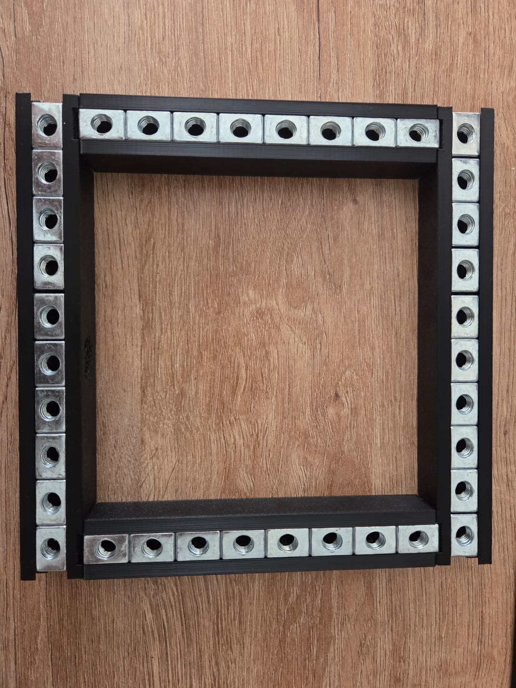

# PCB Stencil Holder

Multiple 3D-printed parts to hold stencils up to 20cm x 20cm using magnets on top of a PCB to apply solder paste.
It has a hinge to facilitate easy swapping of PCB's.

## Additonal Parts needed:
- 36 Screws M8X20mm [like this](https://www.amazon.de/dp/B0D9D8BGZG?ref=ppx_yo2ov_dt_b_fed_asin_title&th=1)
- 36 T-Slot Nuts with an M8 hole [like this](https://www.amazon.de/dp/B0C379BJ17?ref=ppx_yo2ov_dt_b_fed_asin_title&th=1)
- 2 M3x30mm Screws and two hex nuts for them for the hinge
- At least 9 Magnets 16mm x 5mm with a counter-sunk hole [like this](https://www.amazon.de/dp/B08ZHYYVL5?th=1)
- Some 8mm x 3mm Magnets [like this](https://www.amazon.de/dp/B074C79DJS?th=1)

## To Print:
- Two of:
  - [Hinge](Hinge.stl) (once mirrored)
  - [Foot](Foot.stl) (once mirrored)
  - [Short Side A](ShortSideA.stl)
  - [Short Side B](ShortSideB.stl)
  - [Long Side A](LongSideA.stl)
  - [Long Side B](LongSideB.stl)
- One of:
  - [FootConnector](FootConnector.stl)
- Two supports, you can chose between:
  - [Support](Support.stl) a normal support
  - [SupportWithHandle](SupportWithHandle.stl) or a support that is also a handle
- As many as you want of:
  - [SmallMagnetHolder](SmallMagnetHolder.stl) a handle for the 8mm x 3mm Magnets
  - [LargeMagnetHolder](LargeMagnetHolder.stl) a handle for the 16mm x 5mm Magnets, also needs a M3x20mm Screw
  - [PCBHolder_1.6mm](PCBHolder_1.6mm.stl) a holder for the PCB, needs one 16mm x 5mm Magnets, a M3x20mm Screw and a nut
    - This is only for 1.6mm PCB's, it might need to be modified for PCB's with a different thickness

Better images and a proper guide how to assemble it will follow

Additional Files:
- Stencilholder v2.f3d: All parts of the stencil holder
- MagnetHolders.f3d: The magnet and PCB holders

